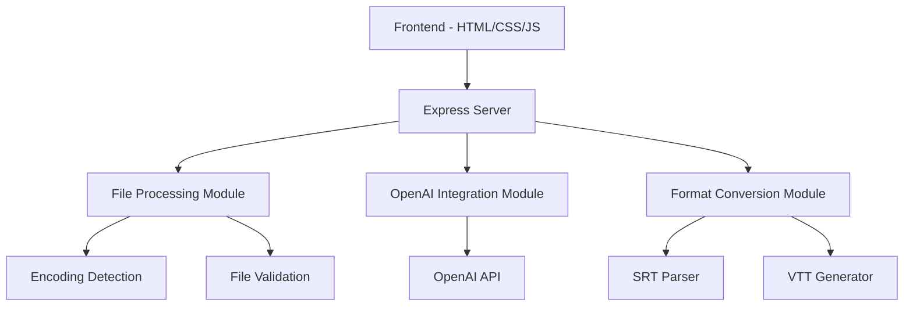

# Design Document

## Overview

The SRT-to-VTT converter is a Node.js web application that provides a simple interface for converting SRT subtitle files to Bunny Stream-compatible VTT format with automatic text correction via OpenAI's GPT API. The application consists of a backend Express server handling file processing and API integration, and a frontend providing drag-and-drop file upload with real-time progress feedback.

## Architecture

The application follows a client-server architecture with clear separation of concerns:



### Technology Stack
- **Backend**: Node.js with Express framework
- **Frontend**: Vanilla HTML, CSS, and JavaScript
- **File Processing**: Multer for multipart uploads, iconv-lite for encoding
- **API Integration**: OpenAI SDK for text correction
- **Environment**: dotenv for configuration management

## Components and Interfaces

### Backend Components

#### 1. Express Server (`server.js`)
- **Purpose**: Main application entry point and HTTP server
- **Port**: 3000
- **Middleware**: CORS, express.json, multer for file uploads
- **Routes**:
  - `GET /` - Serve static frontend files
  - `POST /convert` - Handle SRT file upload and conversion

#### 2. File Processing Module
- **Purpose**: Handle file upload, validation, and encoding detection
- **Functions**:
  - `validateSRTFormat(content)` - Validate SRT file structure
  - `detectEncoding(buffer)` - Auto-detect file encoding
  - `convertToUTF8(buffer, encoding)` - Convert to UTF-8 without BOM

#### 3. OpenAI Integration Module
- **Purpose**: Interface with OpenAI API for text correction
- **Configuration**: API key from environment variables
- **Functions**:
  - `correctSubtitleText(srtContent)` - Send text for correction
  - `buildCorrectionPrompt(text)` - Create GPT prompt for subtitle correction
- **Prompt Template**: 
  ```
  Korrigiere Rechtschreibung und Grammatik dieser Untertitel. 
  Behalte Zeitstempel und Struktur exakt bei. 
  Korrigiere nur den Text zwischen den Zeitstempeln. 
  Behalte Zeilenumbrüche im Text bei. 
  Nutze korrekte deutsche Rechtschreibung (ü, ö, ä, ß).
  ```

#### 4. Format Conversion Module
- **Purpose**: Convert SRT format to Bunny Stream-compatible VTT
- **Functions**:
  - `parseSRT(content)` - Parse SRT into structured data
  - `generateVTT(subtitles)` - Generate VTT format output
  - `convertTimestamp(srtTime)` - Convert comma to period in timestamps

### Frontend Components

#### 1. Upload Interface (`index.html`)
- **Drop Zone**: 300x200px drag-and-drop area
- **File Input**: Hidden file input for click-to-upload fallback
- **Progress Display**: Status indicator showing processing stages
- **Result Area**: Success/error messages and download link

#### 2. JavaScript Controller (`script.js`)
- **Event Handlers**: Drag/drop, file selection, form submission
- **AJAX Communication**: Fetch API for server communication
- **UI Updates**: Progress tracking, error handling, download management

#### 3. Styling (`style.css`)
- **Layout**: Centered, minimalist design
- **Visual Feedback**: Hover states, progress bars, status colors
- **Responsive**: Mobile-friendly layout

## Data Models

### SRT Subtitle Entry
```javascript
{
  index: number,           // Subtitle sequence number (removed in VTT)
  startTime: string,       // Start timestamp (HH:MM:SS,mmm)
  endTime: string,         // End timestamp (HH:MM:SS,mmm)
  text: string            // Subtitle text content
}
```

### VTT Subtitle Entry
```javascript
{
  startTime: string,       // Start timestamp (HH:MM:SS.mmm)
  endTime: string,         // End timestamp (HH:MM:SS.mmm)
  text: string            // Corrected subtitle text
}
```

### Processing Status
```javascript
{
  stage: 'upload' | 'correction' | 'conversion' | 'complete' | 'error',
  message: string,
  progress: number,        // 0-100
  downloadUrl?: string,    // Available when complete
  error?: string          // Error details if applicable
}
```

## Error Handling

### Backend Error Scenarios
1. **File Upload Errors**
   - Invalid file format → 400 Bad Request with descriptive message
   - File too large → 413 Payload Too Large
   - No file provided → 400 Bad Request

2. **OpenAI API Errors**
   - API key missing → 500 Internal Server Error, fallback to conversion only
   - Rate limit exceeded → 429 Too Many Requests, retry with exponential backoff
   - API timeout → 408 Request Timeout, fallback to conversion only

3. **Encoding/Parsing Errors**
   - Unrecognized encoding → Default to UTF-8, log warning
   - Invalid SRT format → 400 Bad Request with format requirements
   - Conversion errors → 500 Internal Server Error with details

### Frontend Error Handling
1. **Network Errors**
   - Connection timeout → Display retry option
   - Server unavailable → Show maintenance message
   - Upload interrupted → Allow re-upload

2. **File Validation**
   - Wrong file type → Clear error message with supported formats
   - File too large → Size limit notification
   - Empty file → Validation error message

### Fallback Mechanisms
- OpenAI API failure → Convert without correction, notify user
- Encoding detection failure → Default to UTF-8, proceed with warning
- Partial processing → Save intermediate results, allow manual retry

## Testing Strategy

### Unit Tests
- **File Processing**: Test encoding detection, SRT parsing, VTT generation
- **Format Conversion**: Verify timestamp conversion, header generation
- **OpenAI Integration**: Mock API responses, test prompt generation
- **Error Handling**: Test all error scenarios and fallbacks

### Integration Tests
- **End-to-End Conversion**: Upload SRT → corrected VTT download
- **API Integration**: Real OpenAI API calls with test data
- **File Handling**: Various encodings and SRT format variations

### Manual Testing Scenarios
1. **Happy Path**: Upload valid SRT → receive corrected VTT
2. **Encoding Issues**: Upload ISO-8859-1 file → proper UTF-8 conversion
3. **API Failures**: Simulate OpenAI downtime → fallback conversion
4. **Invalid Files**: Upload non-SRT files → proper error messages
5. **Large Files**: Test performance with lengthy subtitle files

### Test Data Requirements
- Sample SRT files in different encodings (UTF-8, ISO-8859-1, Windows-1252)
- SRT files with various formatting issues
- Files with special characters and umlauts
- Invalid/corrupted SRT files for error testing
- Large SRT files for performance testing

## Security Considerations

### Input Validation
- File type validation (SRT only)
- File size limits (prevent DoS)
- Content sanitization before OpenAI API calls

### API Security
- OpenAI API key stored in environment variables
- Rate limiting on conversion endpoint
- CORS configuration for frontend access

### Data Privacy
- No persistent storage of uploaded files
- Temporary files cleaned up after processing
- No logging of subtitle content